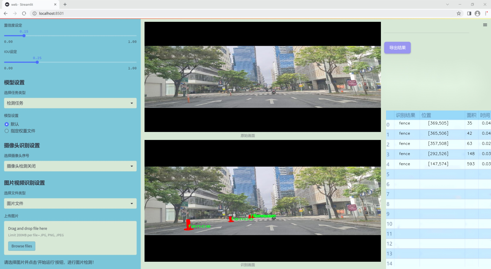
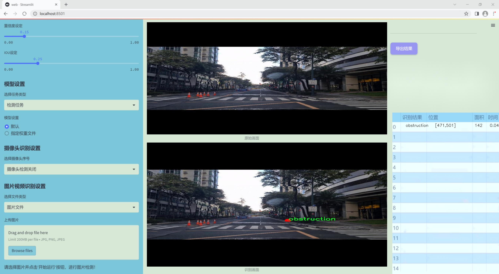
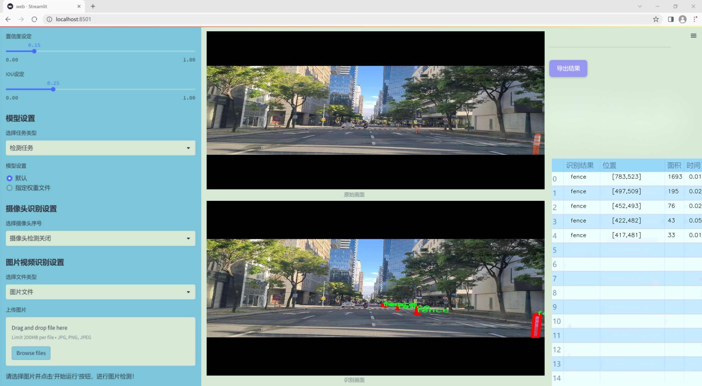
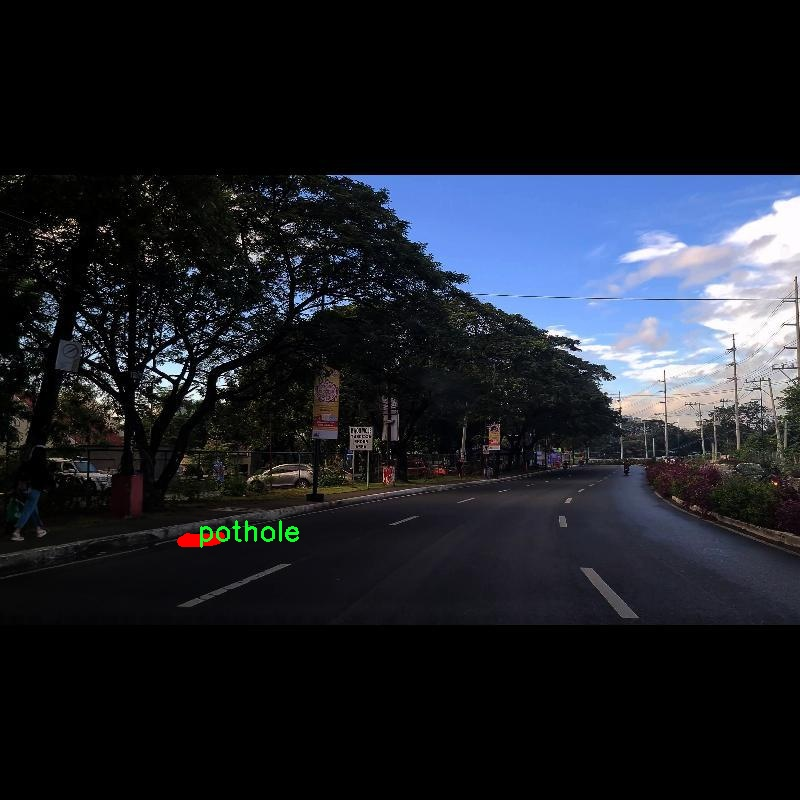
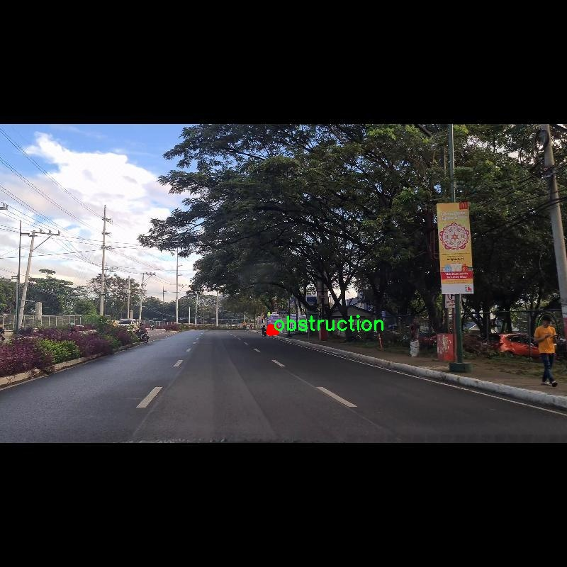
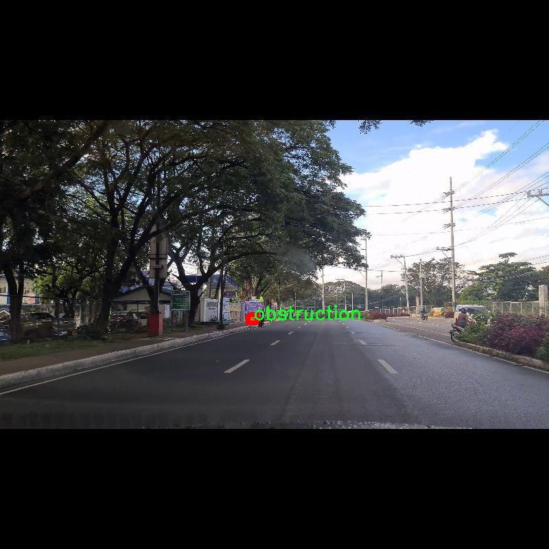
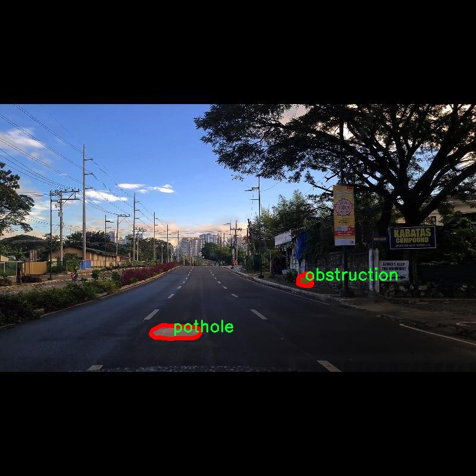
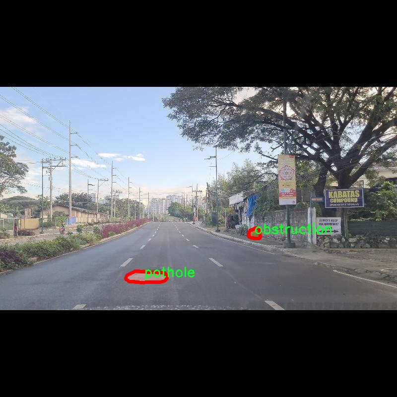

### 1.背景意义

研究背景与意义

随着城市化进程的加快，城市道路的使用频率显著增加，随之而来的道路安全问题也愈发突出。道路障碍物，如施工围挡、围栏、障碍物和坑洼，不仅影响交通流畅性，还可能对行车安全造成严重威胁。因此，开发一种高效、准确的道路障碍物检测系统显得尤为重要。基于深度学习的目标检测技术，尤其是YOLO（You Only Look Once）系列模型，因其实时性和高准确率，成为解决这一问题的理想选择。

本研究旨在基于改进的YOLOv11模型，构建一个专门针对道路障碍物的检测系统。我们将利用RFEX-COCO数据集，该数据集包含1400幅图像，涵盖了四类主要的道路障碍物：施工、围栏、障碍物和坑洼。这些类别的选择不仅反映了现实道路环境中的常见问题，也为模型的训练提供了丰富的样本。通过对这些障碍物的准确检测，可以有效提升交通管理的智能化水平，减少交通事故的发生。

此外，随着计算机视觉技术的不断进步，结合深度学习的道路障碍物检测系统将为智能交通系统的建设提供强有力的支持。该系统不仅可以实时监测道路状况，还能够为交通管理部门提供数据支持，帮助其进行科学决策和规划。通过对道路障碍物的自动检测与识别，我们能够实现对城市交通环境的动态监控，提升道路安全性和通行效率。

综上所述，基于改进YOLOv11的道路障碍物检测系统的研究，不仅具有重要的理论意义，也具备广泛的应用前景。它将为智能交通系统的发展提供新的思路和技术支持，推动城市交通管理的智能化进程。

### 2.视频效果

[2.1 视频效果](https://www.bilibili.com/video/BV11hkyYUEdi/)

### 3.图片效果







##### [项目涉及的源码数据来源链接](https://kdocs.cn/l/cszuIiCKVNis)**

注意：本项目提供训练的数据集和训练教程,由于版本持续更新,暂不提供权重文件（best.pt）,请按照6.训练教程进行训练后实现上图演示的效果。

### 4.数据集信息

##### 4.1 本项目数据集类别数＆类别名

nc: 4
names: ['construction', 'fence', 'obstruction', 'pothole']


该项目为【图像分割】数据集，请在【训练教程和Web端加载模型教程（第三步）】这一步的时候按照【图像分割】部分的教程来训练

##### 4.2 本项目数据集信息介绍

本项目数据集信息介绍

本项目所使用的数据集名为“RFEX-COCO”，旨在为改进YOLOv11的道路障碍物检测系统提供高质量的训练数据。该数据集专注于城市道路环境中的障碍物检测，涵盖了四个主要类别，分别是“construction”（施工）、“fence”（围栏）、“obstruction”（障碍物）和“pothole”（坑洼）。这些类别的选择反映了城市交通中常见的障碍物类型，能够有效提升模型在实际应用中的识别能力。

数据集中包含大量标注精确的图像，确保了每个类别的样本数量足够丰富，能够满足深度学习模型的训练需求。施工区域的图像展示了不同类型的施工标志和设备，围栏类别则包括各种样式的围栏结构，这些元素在城市道路中经常出现。障碍物类别涵盖了多种可能影响交通流畅性的物体，如掉落的物品或其他临时性障碍，而坑洼类别则专注于道路表面的损坏情况，这些都是驾驶安全的重要考量因素。

通过对这些类别的细致标注，RFEX-COCO数据集为YOLOv11模型的训练提供了坚实的基础，使其能够在复杂的城市环境中更准确地识别和分类道路障碍物。该数据集不仅有助于提升模型的检测精度，还能增强其在不同场景下的泛化能力，确保在真实世界应用中能够有效应对各种挑战。总之，RFEX-COCO数据集的构建与应用，将为道路安全和智能交通系统的发展提供重要支持。











### 5.全套项目环境部署视频教程（零基础手把手教学）

[5.1 所需软件PyCharm和Anaconda安装教程（第一步）](https://www.bilibili.com/video/BV1BoC1YCEKi/?spm_id_from=333.999.0.0&vd_source=bc9aec86d164b67a7004b996143742dc)


[5.2 安装Python虚拟环境创建和依赖库安装视频教程（第二步）](https://www.bilibili.com/video/BV1ZoC1YCEBw?spm_id_from=333.788.videopod.sections&vd_source=bc9aec86d164b67a7004b996143742dc)

### 6.改进YOLOv11训练教程和Web_UI前端加载模型教程（零基础手把手教学）

[6.1 改进YOLOv11训练教程和Web_UI前端加载模型教程（第三步）](https://www.bilibili.com/video/BV1BoC1YCEhR?spm_id_from=333.788.videopod.sections&vd_source=bc9aec86d164b67a7004b996143742dc)


按照上面的训练视频教程链接加载项目提供的数据集，运行train.py即可开始训练



     Epoch   gpu_mem       box       obj       cls    labels  img_size
     1/200     20.8G   0.01576   0.01955  0.007536        22      1280: 100%|██████████| 849/849 [14:42<00:00,  1.04s/it]
               Class     Images     Labels          P          R     mAP@.5 mAP@.5:.95: 100%|██████████| 213/213 [01:14<00:00,  2.87it/s]
                 all       3395      17314      0.994      0.957      0.0957      0.0843

     Epoch   gpu_mem       box       obj       cls    labels  img_size
     2/200     20.8G   0.01578   0.01923  0.007006        22      1280: 100%|██████████| 849/849 [14:44<00:00,  1.04s/it]
               Class     Images     Labels          P          R     mAP@.5 mAP@.5:.95: 100%|██████████| 213/213 [01:12<00:00,  2.95it/s]
                 all       3395      17314      0.996      0.956      0.0957      0.0845

     Epoch   gpu_mem       box       obj       cls    labels  img_size
     3/200     20.8G   0.01561    0.0191  0.006895        27      1280: 100%|██████████| 849/849 [10:56<00:00,  1.29it/s]
               Class     Images     Labels          P          R     mAP@.5 mAP@.5:.95: 100%|███████   | 187/213 [00:52<00:00,  4.04it/s]
                 all       3395      17314      0.996      0.957      0.0957      0.0845


###### [项目数据集下载链接](https://kdocs.cn/l/cszuIiCKVNis)

### 7.原始YOLOv11算法讲解

YOLOv11是一种由Ultralytics公司开发的最新一代目标检测模型，以其增强的特征提取能力和更高的效率在计算机视觉领域引人注目。该模型在架构上进行了关键升级，通过更新主干和颈部结构，显著提高了对复杂视觉场景的理解和处理精度。YOLOv11不仅在目标检测上表现出色，还支持实例分割、图像分类、姿态估计和定向目标检测（OBB）等任务，展示出其多功能性。

与其前身YOLOv8相比，YOLOv11在设计上实现了深度和宽度的改变，同时引入了几个创新机制。其中，C3k2机制是对YOLOv8中的C2f的改进，提升了浅层特征的处理能力；C2PSA机制则进一步优化了特征图的处理流程。解耦头的创新设计，通过增加两个深度卷积（DWConv），提高了模型对细节的感知能力和分类准确性。

在性能上，YOLOv11m模型在COCO数据集上的平均精度（mAP）提高，并减少了22%的参数量，确保了在运算效率上的突破。该模型可以部署在多种平台上，包括边缘设备、云平台以及支持NVIDIA GPU的系统，彰显出卓越的灵活性和适应性。总体而言，YOLOv11通过一系列的创新突破，对目标检测领域产生了深远的影响，并为未来的开发提供了新的研究方向。


****文档**** ： _ _https://docs.ultralytics.com/models/yolo11/__

****代码链接**** ： _ _https://github.com/ultralytics/ultralytics__

******Performance Metrics******


​ ** **关键特性****

****◆**** ** **增强的特征提取能力**** ：YOLO11采用了改进的主干和颈部架构，增强了 ** **特征提取****
能力，能够实现更精确的目标检测和复杂任务的执行。

****◆**** ** **优化的效率和速度****
：YOLO11引入了精细化的架构设计和优化的训练流程，提供更快的处理速度，并在准确性和性能之间保持最佳平衡。

****◆**** ** **参数更少、精度更高****
：通过模型设计的改进，YOLO11m在COCO数据集上实现了更高的平均精度（mAP），同时使用的参数比YOLOv8m少22%，使其在计算上更加高效，而不牺牲准确性。

****◆**** ** **跨环境的适应性**** ：YOLO11可以无缝部署在各种环境中，包括边缘设备、云平台和支持NVIDIA
GPU的系统，确保最大的灵活性。

****◆**** ** **支持广泛任务****
：无论是目标检测、实例分割、图像分类、姿态估计还是定向目标检测（OBB），YOLO11都旨在应对一系列计算机视觉挑战。

****支持的任务和模式****


​YOLO11建立在YOLOv8中引入的多功能模型范围之上，为各种计算机视觉任务提供增强的支持:


​该表提供了YOLO11模型变体的概述，展示了它们在特定任务中的适用性以及与Inference、Validation、Training和Export等操作模式的兼容性。从实时检测到复杂的分割任务
，这种灵活性使YOLO11适用于计算机视觉的广泛应用。

##### yolov11的创新

■ yolov8 VS yolov11

YOLOv5，YOLOv8和YOLOv11均是ultralytics公司的作品，ultralytics出品必属精品。


​ **具体创新点** ：

**① 深度（depth）和宽度 （width）**

YOLOv8和YOLOv11是基本上完全不同。

**② C3k2机制**

C3k2有参数为c3k，其中在网络的浅层c3k设置为False。C3k2就相当于YOLOv8中的C2f。


​ **③ C2PSA机制**

下图为C2PSA机制的原理图。


​ **④ 解耦头**

解耦头中的分类检测头增加了两个 **DWConv** 。


▲Conv

    
    
    def autopad(k, p=None, d=1):  # kernel, padding, dilation
    
        """Pad to 'same' shape outputs."""
    
        if d > 1:
    
            k = d * (k - 1) + 1 if isinstance(k, int) else [d * (x - 1) + 1 for x in k]  # actual kernel-size
    
        if p is None:
    
            p = k // 2 if isinstance(k, int) else [x // 2 for x in k]  # auto-pad
    
    return p
    
    
    class Conv(nn.Module):
    
        """Standard convolution with args(ch_in, ch_out, kernel, stride, padding, groups, dilation, activation)."""
    
    
        default_act = nn.SiLU()  # default activation
    
    
        def __init__(self, c1, c2, k=1, s=1, p=None, g=1, d=1, act=True):
    
            """Initialize Conv layer with given arguments including activation."""
    
            super().__init__()
    
            self.conv = nn.Conv2d(c1, c2, k, s, autopad(k, p, d), groups=g, dilation=d, bias=False)
    
            self.bn = nn.BatchNorm2d(c2)
    
            self.act = self.default_act if act is True else act if isinstance(act, nn.Module) else nn.Identity()
    
    
        def forward(self, x):
    
            """Apply convolution, batch normalization and activation to input tensor."""
    
            return self.act(self.bn(self.conv(x)))
    
    
        def forward_fuse(self, x):
    
            """Perform transposed convolution of 2D data."""
    
            return self.act(self.conv(x))

▲Conv2d

    
    
    torch.nn.Conv2d(in_channels, out_channels, kernel_size, stride=1, padding=0, dilation=1, groups=1, bias=True, padding_mode='zeros')

▲DWConv

DWConv ** **代表 Depthwise Convolution（深度卷积）****
，是一种在卷积神经网络中常用的高效卷积操作。它主要用于减少计算复杂度和参数量。

    
    
    class DWConv(Conv):
    
        """Depth-wise convolution."""
    
    
        def __init__(self, c1, c2, k=1, s=1, d=1, act=True):  # ch_in, ch_out, kernel, stride, dilation, activation
    
            """Initialize Depth-wise convolution with given parameters."""
    
            super().__init__(c1, c2, k, s, g=math.gcd(c1, c2), d=d, act=act)


### 8.200+种全套改进YOLOV11创新点原理讲解

#### 8.1 200+种全套改进YOLOV11创新点原理讲解大全

由于篇幅限制，每个创新点的具体原理讲解就不全部展开，具体见下列网址中的改进模块对应项目的技术原理博客网址【Blog】（创新点均为模块化搭建，原理适配YOLOv5~YOLOv11等各种版本）

[改进模块技术原理博客【Blog】网址链接](https://gitee.com/qunmasj/good)


#### 8.2 精选部分改进YOLOV11创新点原理讲解

###### 这里节选部分改进创新点展开原理讲解(完整的改进原理见上图和[改进模块技术原理博客链接](https://gitee.com/qunmasj/good)【如果此小节的图加载失败可以通过CSDN或者Github搜索该博客的标题访问原始博客，原始博客图片显示正常】


### D-LKA Attention简介
自2010年代中期以来，卷积神经网络（CNNs）已成为许多计算机视觉应用的首选技术。它们能够从原始数据中自动提取复杂的特征表示，无需手动进行特征工程，这引起了医学图像分析社区的极大兴趣。许多成功的CNN架构，如U-Net、全卷积网络、DeepLab或SegCaps（分割胶囊），已经被开发出来。这些架构在语义分割任务中取得了巨大成功，先前的最新方法已经被超越。

在计算机视觉研究中，不同尺度下的目标识别是一个关键问题。在CNN中，可检测目标的大小与相应网络层的感受野尺寸密切相关。如果一个目标扩展到超出这个感受野的边界，这可能会导致欠分割结果。相反，与目标实际大小相比使用过大的感受野可能会限制识别，因为背景信息可能会对预测产生不必要的影响。

解决这个问题的一个有希望的方法涉及在并行使用具有不同尺寸的多个Kernel，类似于Inception块的机制。然而，由于参数和计算要求的指数增长，将Kernel大小增加以容纳更大的目标在实践中受到限制。因此，出现了各种策略，包括金字塔池化技术和不同尺度的扩张卷积，以捕获多尺度的上下文信息。

另一个直观的概念涉及将多尺度图像金字塔或它们的相关特征表示直接纳入网络架构。然而，这种方法存在挑战，特别是在管理训练和推理时间方面的可行性方面存在挑战。在这个背景下，使用编码器-解码器网络，如U-Net，已被证明是有利的。这样的网络在较浅的层中编码外观和位置，而在更深的层中，通过神经元的更广泛的感受野捕获更高的语义信息和上下文信息。

一些方法将来自不同层的特征组合在一起，或者预测来自不同尺寸的层的特征以使用多尺度的信息。此外，出现了从不同尺度的层中预测特征的方法，有效地实现了跨多个尺度的见解整合。然而，大多数编码器-解码器结构面临一个挑战：它们经常无法在不同尺度之间保持一致的特征，并主要使用最后一个解码器层生成分割结果。

语义分割是一项任务，涉及根据预定义的标签集为图像中的每个像素预测语义类别。这项任务要求提取高级特征同时保留初始的空间分辨率。CNNs非常适合捕获局部细节和低级信息，尽管以忽略全局上下文为代价。视觉Transformer（ViT）架构已经成为解决处理全局信息的视觉任务的关键，包括语义分割，取得了显著的成功。

ViT的基础是注意力机制，它有助于在整个输入序列上聚合信息。这种能力使网络能够合并远程的上下文提示，超越了CNN的有限感受野尺寸。然而，这种策略通常会限制ViT有效建模局部信息的能力。这种局限可能会妨碍它们检测局部纹理的能力，这对于各种诊断和预测任务至关重要。这种缺乏局部表示可以归因于ViT模型处理图像的特定方式。

ViT模型将图像分成一系列Patch，并使用自注意力机制来模拟它们之间的依赖关系。这种方法可能不如CNN模型中的卷积操作对感受野内提取局部特征有效。ViT和CNN模型之间的这种图像处理方法的差异可能解释了CNN模型在局部特征提取方面表现出色的原因。

近年来，已经开发出创新性方法来解决Transformer模型内部局部纹理不足的问题。其中一种方法是通过互补方法将CNN和ViT特征结合起来，以结合它们的优势并减轻局部表示的不足。TransUNet是这种方法的早期示例，它在CNN的瓶颈中集成了Transformer层，以模拟局部和全局依赖关系。HiFormer提出了一种解决方案，将Swin Transformer模块和基于CNN的编码器结合起来，生成两个多尺度特征表示，通过Double-Level Fusion模块集成。UNETR使用基于Transformer的编码器和CNN解码器进行3D医学图像分割。CoTr和TransBTS通过Transformer在低分辨率阶段增强分割性能，将CNN编码器和解码器连接在一起。

增强局部特征表示的另一种策略是重新设计纯Transformer模型内部的自注意力机制。在这方面，Swin-Unet在U形结构中集成了一个具有线性计算复杂性的Swin Transformer块作为多尺度 Backbone 。MISSFormer采用高效Transformer来解决视觉Transformer中的参数问题，通过在输入块上进行不可逆的降采样操作。D-Former引入了一个纯Transformer的管道，具有双重注意模块，以分段的方式捕获细粒度的局部注意和与多元单元的交互。然而，仍然存在一些特定的限制，包括计算效率低下，如TransUNet模型所示，对CNN Backbone 的严重依赖，如HiFormer所观察到的，以及对多尺度信息的忽略。

此外，目前的分割架构通常采用逐层处理3D输入 volumetric 的方法，无意中忽视了相邻切片之间的潜在相关性。这一疏忽限制了对 volumetric 信息的全面利用，因此损害了定位精度和上下文集成。此外，必须认识到，医学领域的病变通常在形状上发生变形。因此，用于医学图像分析的任何学习算法都必须具备捕捉和理解这些变形的能力。与此同时，该算法应保持计算效率，以便处理3D volumetric数据。

为了解决上述提到的挑战，作者提出了一个解决方案，即可变形大卷积核注意力模块（Deformable LKA module），它是作者网络设计的基本构建模块。这个模块明确设计成在有效处理上下文信息的同时保留局部描述符。作者的架构在这两个方面的平衡增强了实现精确语义分割的能力。

值得注意的是，参考该博客引入了一种基于数据的感受野的动态适应，不同于传统卷积操作中的固定滤波器Mask。这种自适应方法使作者能够克服与静态方法相关的固有限制。这种创新方法还扩展到了D-LKA Net架构的2D和3D版本的开发。

在3D模型的情况下，D-LKA机制被量身定制以适应3D环境，从而实现在不同 volumetric 切片之间无缝信息交互。最后，作者的贡献通过其计算效率得到进一步强调。作者通过仅依靠D-LKA概念的设计来实现这一点，在各种分割基准上取得了显著的性能，确立了作者的方法作为一种新的SOTA方法。

在本节中，作者首先概述方法论。首先，作者回顾了由Guo等人引入的大卷积核注意力（Large Kernel Attention，LKA）的概念。然后，作者介绍了作者对可变形LKA模块的创新探索。在此基础上，作者介绍了用于分割任务的2D和3D网络架构。

大卷积核提供了与自注意力机制类似的感受野。可以通过使用深度卷积、深度可扩展卷积和卷积来构建大卷积核，从而减少了参数和计算量。构建输入维度为和通道数的卷积核的深度卷积和深度可扩展卷积的卷积核大小的方程如下：


具有卷积核大小和膨胀率。参数数量和浮点运算（FLOPs）的计算如下：


FLOPs的数量与输入图像的大小成线性增长。参数的数量随通道数和卷积核大小的增加而呈二次增长。然而，由于它们通常都很小，因此它们不是限制因素。

为了最小化对于固定卷积核大小K的参数数量，可以将方程3对于膨胀率的导数设定为零：


例如，当卷积核大小为时，结果是。将这些公式扩展到3D情况是直接的。对于大小为和通道数C的输入，3D情况下参数数量和FLOPs 的方程如下：


具有卷积核大小和膨胀。


利用大卷积核进行医学图像分割的概念通过引入可变形卷积得以扩展。可变形卷积可以通过整数偏移自由调整采样网格以进行自由变形。额外的卷积层从特征图中学习出变形，从而创建一个偏移场。基于特征本身学习变形会导致自适应卷积核。这种灵活的卷积核形状可以提高病变或器官变形的表示，从而增强了目标边界的定义。

负责计算偏移的卷积层遵循其相应卷积层的卷积核大小和膨胀。双线性插值用于计算不在图像网格上的偏移的像素值。如图2所示，D-LKA模块可以表示为：


其中输入特征由表示，。表示为注意力图，其中每个值表示相应特征的相对重要性。运算符  表示逐元素乘法运算。值得注意的是，LKA不同于传统的注意力方法，它不需要额外的规范化函数，如或。这些规范化函数往往忽视高频信息，从而降低了基于自注意力的方法的性能。

在该方法的2D版本中，卷积层被可变形卷积所替代，因为可变形卷积能够改善对具有不规则形状和大小的目标的捕捉能力。这些目标在医学图像数据中常常出现，因此这种增强尤为重要。

然而，将可变形LKA的概念扩展到3D领域会带来一定的挑战。主要的约束来自于需要用于生成偏移的额外卷积层。与2D情况不同，由于输入和输出通道的性质，这一层无法以深度可分的方式执行。在3D环境中，输入通道对应于特征，而输出通道扩展到，其中是卷积核的大小。大卷积核的复杂性导致沿第3D的通道数扩展，导致参数和FLOPs大幅增加。因此，针对3D情况采用了另一种替代方法。在现有的LKA框架中，深度卷积之后引入了一个单独的可变形卷积层。这种战略性的设计调整旨在减轻扩展到3D领域所带来的挑战。


2D网络的架构如图1所示。第一变种使用MaxViT作为编码器组件，用于高效特征提取，而第二变种则结合可变形LKA层进行更精细、卓越的分割。

在更正式的描述中，编码器生成4个分层输出表示。首先，卷积干扰将输入图像的维度减小到。随后，通过4个MaxViT块的4个阶段进行特征提取，每个阶段后跟随降采样层。随着过程进展到解码器，实施了4个阶段的D-LKA层，每个阶段包含2个D-LKA块。然后，应用Patch扩展层以实现分辨率上采样，同时减小通道维度。最后，线性层负责生成最终的输出。

2D D-LKA块的结构包括LayerNorm、可变形LKA和多层感知器（MLP）。积分残差连接确保了有效的特征传播，即使在更深层也是如此。这个安排可以用数学方式表示为：


其中输入特征，层归一化LN，可变形LKA注意力，深度卷积，线性层和GeLU激活函数。

3D网络架构如图1所示，采用编码器-解码器设计进行分层结构化。首先，一个Patch嵌入层将输入图像的维度从（）减小到（）。在编码器中，采用了3个D-LKA阶段的序列，每个阶段包含3个D-LKA块。在每个阶段之后，通过降采样步骤将空间分辨率减半，同时将通道维度加倍。中央瓶颈包括另一组2个D-LKA块。解码器结构与编码器相对称。

为了将特征分辨率加倍，同时减少通道数，使用转置卷积。每个解码器阶段都使用3个D-LKA块来促进远距离特征依赖性。最终的分割输出由一个卷积层产生，后面跟随一个卷积层以匹配特定类别的通道要求。

为了建立输入图像和分割输出之间的直接连接，使用卷积形成了一个跳跃连接。额外的跳跃连接根据简单的加法对来自其他阶段的特征进行融合。最终的分割图是通过和卷积层的组合产生的。

3D D-LKA块包括层归一化，后跟D-LKA注意力，应用了残差连接的部分。随后的部分采用了一个卷积层，后面跟随一个卷积层，两者都伴随着残差连接。这个整个过程可以总结如下：


带有输入特征 、层归一化 、可变形 LKA 、卷积层 和输出特征 的公式。是指一个前馈网络，包括2个卷积层和激活函数。

表7显示了普通卷积和构建卷积的参数数量比较。尽管标准卷积的参数数量在通道数较多时急剧增加，但分解卷积的参数总体较低，并且增长速度不那么快。

与分解卷积相比，可变形分解卷积增加了大量参数，但仍然明显小于标准卷积。可变形卷积的主要参数是由偏移网络创建的。在这里，作者假设可变形深度卷积的Kernel大小为（5,5），可变形深度空洞卷积的Kernel大小为（7,7）。这导致了21×21大小的大Kernel的最佳参数数量。更高效地生成偏移量的方法将大大减少参数数量。


值得注意的是，引入可变形LKA确实会增加模型的参数数量和每秒的浮点运算次数（FLOPS）。然而，重要的是强调，这增加的计算负载不会影响作者模型的整体推理速度。

相反，对于Batch-size > 1，作者甚至观察到推理时间的减少，如图7所示。例如，基于作者的广泛实验，作者观察到对于Batch-size为16，具有可变形卷积和没有可变形卷积的推理时间分别为8.01毫秒和17.38毫秒。作者认为这是由于在2D中对可变形卷积的高效实现所致。为了测量时间，使用了大小为（）的随机输入。在GPU热身周期50次迭代之后，网络被推断了1000次。测量是在NVIDIA RTX 3090 GPU上进行的。


为了充分利用性能与参数之间的权衡关系，作者在图8中可视化了在Synapse 2D数据集上报告的DSC和HD性能以及基于参数数量的内存消耗。D-LKA Net引入了相当多的参数，约为101M。这比性能第二好的方法ScaleFormer使用的111.6M参数要少。

与更轻量级的DAEFormer模型相比，作者实现了更好的性能，这证明了参数增加的合理性。大多数参数来自于MaxViT编码器；因此，将编码器替换为更高效的编码器可以减少模型参数。值得注意的是，在此可视化中，作者最初将HD和内存值都归一化到[0, 100]范围内。随后，作者将它们从100缩小，以增强更高值的表示。


### 9.系统功能展示

图9.1.系统支持检测结果表格显示

  图9.2.系统支持置信度和IOU阈值手动调节

  图9.3.系统支持自定义加载权重文件best.pt(需要你通过步骤5中训练获得)

  图9.4.系统支持摄像头实时识别

  图9.5.系统支持图片识别

  图9.6.系统支持视频识别

  图9.7.系统支持识别结果文件自动保存

  图9.8.系统支持Excel导出检测结果数据


### 10. YOLOv11核心改进源码讲解

#### 10.1 transformer.py

以下是经过简化和注释的核心代码，保留了最重要的部分，并对每个部分进行了详细的中文注释：

```python
import torch
import torch.nn as nn
from functools import partial

# 引入自定义的归一化模块
from .prepbn import RepBN, LinearNorm
from ..modules.transformer import TransformerEncoderLayer

# 定义线性归一化的部分函数
ln = nn.LayerNorm
linearnorm = partial(LinearNorm, norm1=ln, norm2=RepBN, step=60000)

class TransformerEncoderLayer_RepBN(TransformerEncoderLayer):
    """使用RepBN的Transformer编码器层。"""
    
    def __init__(self, c1, cm=2048, num_heads=8, dropout=0, act=..., normalize_before=False):
        # 初始化父类
        super().__init__(c1, cm, num_heads, dropout, act, normalize_before)
        
        # 定义两个归一化层
        self.norm1 = linearnorm(c1)
        self.norm2 = linearnorm(c1)

class AIFI_RepBN(TransformerEncoderLayer_RepBN):
    """定义AIFI Transformer层。"""

    def __init__(self, c1, cm=2048, num_heads=8, dropout=0, act=nn.GELU(), normalize_before=False):
        """初始化AIFI实例，指定参数。"""
        super().__init__(c1, cm, num_heads, dropout, act, normalize_before)

    def forward(self, x):
        """AIFI Transformer层的前向传播。"""
        c, h, w = x.shape[1:]  # 获取输入的通道数、高度和宽度
        pos_embed = self.build_2d_sincos_position_embedding(w, h, c)  # 构建位置嵌入
        # 将输入张量从形状[B, C, H, W]展平为[B, HxW, C]
        x = super().forward(x.flatten(2).permute(0, 2, 1), pos=pos_embed.to(device=x.device, dtype=x.dtype))
        # 将输出重新排列为形状[B, C, H, W]
        return x.permute(0, 2, 1).view([-1, c, h, w]).contiguous()

    @staticmethod
    def build_2d_sincos_position_embedding(w, h, embed_dim=256, temperature=10000.0):
        """构建2D正弦-余弦位置嵌入。"""
        assert embed_dim % 4 == 0, "嵌入维度必须是4的倍数，以便进行2D正弦-余弦位置嵌入"
        
        # 创建宽度和高度的网格
        grid_w = torch.arange(w, dtype=torch.float32)
        grid_h = torch.arange(h, dtype=torch.float32)
        grid_w, grid_h = torch.meshgrid(grid_w, grid_h, indexing="ij")
        
        pos_dim = embed_dim // 4  # 计算位置维度
        omega = torch.arange(pos_dim, dtype=torch.float32) / pos_dim
        omega = 1.0 / (temperature**omega)  # 计算频率

        # 计算正弦和余弦位置嵌入
        out_w = grid_w.flatten()[..., None] @ omega[None]
        out_h = grid_h.flatten()[..., None] @ omega[None]

        # 返回拼接后的正弦和余弦嵌入
        return torch.cat([torch.sin(out_w), torch.cos(out_w), torch.sin(out_h), torch.cos(out_h)], 1)[None]
```

### 代码分析：
1. **模块导入**：导入了必要的PyTorch模块和自定义的归一化模块。
2. **线性归一化**：使用`partial`函数创建了一个线性归一化的部分函数，便于后续使用。
3. **Transformer编码器层**：`TransformerEncoderLayer_RepBN`类继承自`TransformerEncoderLayer`，并在其构造函数中定义了两个归一化层。
4. **AIFI Transformer层**：`AIFI_RepBN`类继承自`TransformerEncoderLayer_RepBN`，并实现了前向传播和位置嵌入的构建。
5. **前向传播**：在`forward`方法中，输入张量被展平并传递给父类的前向方法，同时计算位置嵌入。
6. **位置嵌入构建**：`build_2d_sincos_position_embedding`静态方法用于生成2D正弦-余弦位置嵌入，确保嵌入维度是4的倍数，并计算相应的频率。

通过这些注释，代码的功能和结构变得更加清晰，便于理解和维护。

该文件定义了一个用于实现Transformer编码器层的类，特别是结合了RepBN（重参数化批归一化）和线性归一化的变体。首先，导入了必要的PyTorch库和模块，包括神经网络模块和功能模块。然后，定义了一个`linearnorm`的部分应用函数，它将线性归一化和重参数化批归一化结合在一起，适用于后续的网络层。

接下来，定义了`TransformerEncoderLayer_RepBN`类，它继承自`TransformerEncoderLayer`。在构造函数中，调用父类的构造函数，并初始化两个归一化层`norm1`和`norm2`，这两个层使用了之前定义的`linearnorm`。

然后，定义了`AIFI_RepBN`类，继承自`TransformerEncoderLayer_RepBN`，用于实现特定的AIFI Transformer层。在构造函数中，调用父类的构造函数，并设置激活函数为GELU（高斯误差线性单元），同时可以选择是否在前向传播之前进行归一化。

在`forward`方法中，首先获取输入张量的形状，提取通道数、高度和宽度。接着，调用`build_2d_sincos_position_embedding`方法生成二维正弦余弦位置嵌入。输入张量被展平并进行维度转换，以适应Transformer的输入格式。然后，调用父类的`forward`方法进行前向传播，最后将输出张量的维度恢复为原始形状。

`build_2d_sincos_position_embedding`是一个静态方法，用于构建二维正弦余弦位置嵌入。该方法首先检查嵌入维度是否可以被4整除，这是实现二维位置嵌入的必要条件。接着，创建宽度和高度的网格，并计算出相应的正弦和余弦值，最终返回一个包含这些位置嵌入的张量。

总的来说，该文件实现了一个自定义的Transformer编码器层，结合了重参数化批归一化和线性归一化，并通过正弦余弦位置嵌入增强了模型的空间特征表示能力。

#### 10.2 activation.py

```python
import torch
import torch.nn as nn

class AGLU(nn.Module):
    """AGLU激活函数模块，来源于https://github.com/kostas1515/AGLU。"""

    def __init__(self, device=None, dtype=None) -> None:
        """初始化AGLU激活函数模块。"""
        super().__init__()
        # 使用Softplus作为基础激活函数，beta设置为-1.0
        self.act = nn.Softplus(beta=-1.0)
        # 初始化lambda参数，使用均匀分布
        self.lambd = nn.Parameter(nn.init.uniform_(torch.empty(1, device=device, dtype=dtype)))  
        # 初始化kappa参数，使用均匀分布
        self.kappa = nn.Parameter(nn.init.uniform_(torch.empty(1, device=device, dtype=dtype)))  

    def forward(self, x: torch.Tensor) -> torch.Tensor:
        """计算AGLU激活函数的前向传播。"""
        # 确保lambda参数的值不小于0.0001
        lam = torch.clamp(self.lambd, min=0.0001)
        # 计算AGLU激活函数的输出
        return torch.exp((1 / lam) * self.act((self.kappa * x) - torch.log(lam)))
```

### 代码注释说明：
1. **导入必要的库**：导入PyTorch及其神经网络模块。
2. **AGLU类**：定义了一个名为`AGLU`的类，继承自`nn.Module`，表示一个自定义的激活函数模块。
3. **初始化方法**：
   - `self.act`：使用`Softplus`作为基础激活函数，`beta`参数设置为-1.0。
   - `self.lambd`和`self.kappa`：定义了两个可学习的参数，`lambd`和`kappa`，并使用均匀分布进行初始化。
4. **前向传播方法**：
   - `lam`：通过`torch.clamp`确保`lambd`的值不小于0.0001，以避免在后续计算中出现数值不稳定。
   - 返回值：计算并返回AGLU激活函数的输出，公式为`exp((1 / lam) * act((kappa * x) - log(lam)))`。

这个程序文件名为 `activation.py`，主要实现了一个名为 AGLU 的激活函数模块。该模块是基于 PyTorch 深度学习框架构建的，使用了 PyTorch 的神经网络模块（`torch.nn`）。

在文件的开头，首先导入了必要的库，包括 `torch` 和 `torch.nn`。接着定义了一个名为 `AGLU` 的类，该类继承自 `nn.Module`，这是 PyTorch 中所有神经网络模块的基类。

在 `AGLU` 类的构造函数 `__init__` 中，初始化了激活函数的相关参数。首先调用了父类的构造函数 `super().__init__()`。然后，定义了一个 Softplus 激活函数实例，使用 `beta=-1.0` 来初始化。接下来，定义了两个可学习的参数 `lambd` 和 `kappa`，这两个参数的初始值是通过均匀分布随机初始化的，使用了 `torch.empty` 创建一个空的张量，并指定了设备（`device`）和数据类型（`dtype`）。

在 `forward` 方法中，定义了前向传播的计算过程。该方法接收一个张量 `x` 作为输入，并计算激活函数的输出。首先，通过 `torch.clamp` 将 `lambd` 限制在一个最小值（0.0001）以上，以避免出现数值不稳定的情况。然后，使用公式计算激活函数的输出，具体是先计算 `self.kappa * x`，再减去 `torch.log(lam)`，最后通过 Softplus 函数处理并进行指数运算。

总的来说，这个模块实现了一个自定义的激活函数 AGLU，结合了可学习的参数和非线性变换，适用于深度学习模型中的激活层。

#### 10.3 EfficientFormerV2.py

以下是简化后的代码，保留了核心部分，并添加了详细的中文注释：

```python
import torch
import torch.nn as nn
import math
import itertools

class Attention4D(nn.Module):
    """4D注意力机制模块"""
    def __init__(self, dim=384, key_dim=32, num_heads=8, attn_ratio=4, resolution=7):
        super().__init__()
        self.num_heads = num_heads  # 注意力头的数量
        self.scale = key_dim ** -0.5  # 缩放因子
        self.resolution = resolution  # 输入的分辨率
        self.N = resolution ** 2  # 输入的总位置数

        # 定义查询、键、值的卷积层
        self.q = nn.Conv2d(dim, num_heads * key_dim, kernel_size=1)
        self.k = nn.Conv2d(dim, num_heads * key_dim, kernel_size=1)
        self.v = nn.Conv2d(dim, num_heads * attn_ratio * key_dim, kernel_size=1)

        # 注意力偏置参数
        self.attention_biases = nn.Parameter(torch.zeros(num_heads, len(self._get_attention_offsets())))

    def _get_attention_offsets(self):
        """计算注意力偏置的偏移量"""
        points = list(itertools.product(range(self.resolution), repeat=2))
        attention_offsets = {}
        idxs = []
        for p1 in points:
            for p2 in points:
                offset = (abs(p1[0] - p2[0]), abs(p1[1] - p2[1]))
                if offset not in attention_offsets:
                    attention_offsets[offset] = len(attention_offsets)
                idxs.append(attention_offsets[offset])
        return idxs

    def forward(self, x):
        """前向传播"""
        B, C, H, W = x.shape  # B: 批量大小, C: 通道数, H: 高度, W: 宽度
        q = self.q(x).view(B, self.num_heads, -1, self.N).permute(0, 1, 3, 2)  # 查询
        k = self.k(x).view(B, self.num_heads, -1, self.N).permute(0, 1, 2, 3)  # 键
        v = self.v(x).view(B, self.num_heads, -1, self.N).permute(0, 1, 3, 2)  # 值

        # 计算注意力权重
        attn = (q @ k) * self.scale + self.attention_biases
        attn = attn.softmax(dim=-1)  # 归一化

        # 应用注意力权重
        x = (attn @ v).permute(0, 1, 3, 2).reshape(B, -1, self.resolution, self.resolution)
        return x

class EfficientFormerV2(nn.Module):
    """EfficientFormer V2模型"""
    def __init__(self, layers, embed_dims):
        super().__init__()
        self.patch_embed = nn.Conv2d(3, embed_dims[0], kernel_size=3, stride=2, padding=1)  # 初始嵌入层
        self.network = nn.ModuleList()  # 存储网络的各个层

        for i in range(len(layers)):
            # 添加每个层的注意力模块
            self.network.append(Attention4D(dim=embed_dims[i], resolution=math.ceil(640 / (2 ** (i + 2)))))

    def forward(self, x):
        """前向传播"""
        x = self.patch_embed(x)  # 通过嵌入层
        for block in self.network:
            x = block(x)  # 通过每个注意力模块
        return x

def efficientformerv2_s0():
    """创建EfficientFormer V2 S0模型实例"""
    model = EfficientFormerV2(layers=[2, 2, 6, 4], embed_dims=[32, 48, 96, 176])
    return model

if __name__ == '__main__':
    inputs = torch.randn((1, 3, 640, 640))  # 输入张量
    model = efficientformerv2_s0()  # 创建模型
    res = model(inputs)  # 前向传播
    print(res.size())  # 输出结果的尺寸
```

### 代码说明：
1. **Attention4D类**：实现了一个4D注意力机制模块，包含查询、键、值的卷积层，并计算注意力权重。
2. **EfficientFormerV2类**：构建了EfficientFormer V2模型，包含多个注意力模块。
3. **efficientformerv2_s0函数**：创建S0版本的EfficientFormer V2模型实例。
4. **主程序**：生成一个随机输入，创建模型并进行前向传播，最后输出结果的尺寸。

以上代码是EfficientFormer V2模型的核心部分，去除了不必要的复杂性，便于理解和使用。

这个程序文件实现了一个名为 `EfficientFormerV2` 的深度学习模型，主要用于图像处理任务，如图像分类。该模型基于高效的变换器架构，具有多种配置以适应不同的应用需求。

首先，文件中定义了一些模型的超参数，包括不同规模的模型的宽度和深度。`EfficientFormer_width` 和 `EfficientFormer_depth` 字典分别定义了不同模型（如 S0、S1、S2 和 L）的通道数和层数。这些参数为后续模型的构建提供了基础。

接下来，定义了多个类，其中 `Attention4D` 和 `Attention4DDownsample` 是实现自注意力机制的关键模块。这些模块通过卷积层和注意力机制来处理输入数据，并在空间上进行信息聚合。`Attention4D` 类中实现了多头自注意力机制，支持可选的下采样功能，而 `Attention4DDownsample` 则专注于在下采样时保持特征的完整性。

`Embedding` 类用于将输入图像嵌入到更高维的特征空间，采用卷积操作和归一化层。`Mlp` 类实现了多层感知机（MLP），用于进一步处理特征。`AttnFFN` 和 `FFN` 类则结合了注意力机制和前馈网络，形成了模型的基本构建块。

`eformer_block` 函数用于构建一个块，其中包含多个 `AttnFFN` 和 `FFN` 层，允许根据给定的层数和其他参数灵活配置模型结构。`EfficientFormerV2` 类则是整个模型的主体，负责将各个块组合在一起，并定义前向传播的逻辑。

在模型的前向传播中，输入图像首先通过 `patch_embed` 进行处理，然后依次通过网络中的各个块，最终输出特征。模型支持在不同的阶段提取特征，以便于后续的分类或其他任务。

文件的最后部分定义了一些函数，用于创建不同规模的 `EfficientFormerV2` 模型，并加载预训练权重。通过 `efficientformerv2_s0`、`efficientformerv2_s1`、`efficientformerv2_s2` 和 `efficientformerv2_l` 函数，可以快速实例化不同配置的模型。

在 `__main__` 部分，程序创建了输入张量并测试了不同规模的模型，输出了每个模型的特征图尺寸。这为用户提供了一个简单的接口来验证模型的功能和性能。

总体而言，这个程序文件实现了一个灵活且高效的图像处理模型，适用于各种计算机视觉任务。

#### 10.4 cfpt.py

以下是代码中最核心的部分，并附上详细的中文注释：

```python
import torch
import torch.nn as nn
import torch.nn.functional as F
from timm.layers import to_2tuple, trunc_normal_

class CrossLayerPosEmbedding3D(nn.Module):
    def __init__(self, num_heads=4, window_size=(5, 3, 1), spatial=True):
        super(CrossLayerPosEmbedding3D, self).__init__()
        self.spatial = spatial  # 是否使用空间位置嵌入
        self.num_heads = num_heads  # 注意力头的数量
        self.layer_num = len(window_size)  # 层数
        # 初始化相对位置偏置表
        self.relative_position_bias_table = nn.Parameter(
            torch.zeros((2 * window_size[0] - 1) * (2 * window_size[0] - 1), num_heads)
        )
        # 计算相对位置索引
        self.register_buffer("relative_position_index", self.calculate_relative_position_index(window_size))
        trunc_normal_(self.relative_position_bias_table, std=.02)  # 初始化相对位置偏置

        # 初始化绝对位置偏置
        self.absolute_position_bias = nn.Parameter(torch.zeros(len(window_size), num_heads, 1, 1, 1))
        trunc_normal_(self.absolute_position_bias, std=.02)  # 初始化绝对位置偏置

    def calculate_relative_position_index(self, window_size):
        # 计算相对位置索引的逻辑
        coords_h = [torch.arange(ws) - ws // 2 for ws in window_size]
        coords_w = [torch.arange(ws) - ws // 2 for ws in window_size]
        coords = [torch.stack(torch.meshgrid([coord_h, coord_w])) for coord_h, coord_w in zip(coords_h, coords_w)]
        coords_flatten = torch.cat([torch.flatten(coord, 1) for coord in coords], dim=-1)
        relative_coords = coords_flatten[:, :, None] - coords_flatten[:, None, :]
        relative_coords = relative_coords.permute(1, 2, 0).contiguous()
        relative_coords[:, :, 0] += window_size[0] - 1
        relative_coords[:, :, 1] += window_size[0] - 1
        relative_coords[:, :, 0] *= 2 * window_size[0] - 1
        return relative_coords.sum(-1)

    def forward(self):
        # 前向传播，计算位置嵌入
        pos_indicies = self.relative_position_index.view(-1)
        pos_indicies_floor = torch.floor(pos_indicies).long()
        pos_indicies_ceil = torch.ceil(pos_indicies).long()
        value_floor = self.relative_position_bias_table[pos_indicies_floor]
        value_ceil = self.relative_position_bias_table[pos_indicies_ceil]
        weights_ceil = pos_indicies - pos_indicies_floor.float()
        weights_floor = 1.0 - weights_ceil

        pos_embed = weights_floor.unsqueeze(-1) * value_floor + weights_ceil.unsqueeze(-1) * value_ceil
        pos_embed = pos_embed.reshape(1, 1, self.num_token, -1, self.num_heads).permute(0, 4, 1, 2, 3)

        # 返回位置嵌入
        return pos_embed

class CrossLayerSpatialAttention(nn.Module):
    def __init__(self, in_dim, layer_num=3, beta=1, num_heads=4, mlp_ratio=2, reduction=4):
        super(CrossLayerSpatialAttention, self).__init__()
        self.num_heads = num_heads  # 注意力头的数量
        self.reduction = reduction  # 降维比例
        self.window_sizes = [(2 ** i + beta) if i != 0 else (2 ** i + beta - 1) for i in range(layer_num)][::-1]
        self.token_num_per_layer = [i ** 2 for i in self.window_sizes]  # 每层的token数量
        self.token_num = sum(self.token_num_per_layer)  # 总token数量

        # 初始化卷积层、归一化层、注意力层等
        self.cpe = nn.ModuleList([ConvPosEnc(dim=in_dim, k=3) for _ in range(layer_num)])
        self.norm1 = nn.ModuleList(LayerNormProxy(in_dim) for _ in range(layer_num))
        self.norm2 = nn.ModuleList(nn.LayerNorm(in_dim) for _ in range(layer_num))
        self.qkv = nn.ModuleList(nn.Conv2d(in_dim, in_dim, kernel_size=1) for _ in range(layer_num))
        self.softmax = nn.Softmax(dim=-1)
        self.proj = nn.ModuleList(nn.Conv2d(in_dim, in_dim, kernel_size=1) for _ in range(layer_num))
        self.pos_embed = CrossLayerPosEmbedding3D(num_heads=num_heads, window_size=self.window_sizes, spatial=True)

    def forward(self, x_list):
        # 前向传播，计算注意力
        q_list, k_list, v_list = [], [], []
        for i, x in enumerate(x_list):
            qkv = self.qkv[i](x)  # 计算Q、K、V
            q, k, v = qkv.chunk(3, dim=1)  # 分割Q、K、V
            q_list.append(q)
            k_list.append(k)
            v_list.append(v)

        # 计算注意力
        q_stack = torch.cat(q_list, dim=1)
        k_stack = torch.cat(k_list, dim=1)
        v_stack = torch.cat(v_list, dim=1)
        attn = F.normalize(q_stack, dim=-1) @ F.normalize(k_stack, dim=-1).transpose(-1, -2)
        attn = attn + self.pos_embed()  # 加入位置嵌入
        attn = self.softmax(attn)

        # 计算输出
        out = attn @ v_stack
        return out

class ConvPosEnc(nn.Module):
    def __init__(self, dim, k=3, act=True):
        super(ConvPosEnc, self).__init__()
        self.proj = nn.Conv2d(dim, dim, kernel_size=k, padding=k // 2, groups=dim)  # 深度可分离卷积
        self.activation = nn.GELU() if act else nn.Identity()  # 激活函数

    def forward(self, x):
        feat = self.proj(x)  # 卷积操作
        return x + self.activation(feat)  # 残差连接
```

### 代码核心部分说明：
1. **CrossLayerPosEmbedding3D**: 该类用于计算跨层的3D位置嵌入，包括相对位置和绝对位置的偏置。通过计算相对位置索引来生成位置嵌入，便于后续的注意力计算。

2. **CrossLayerSpatialAttention**: 该类实现了跨层空间注意力机制。它通过对输入进行卷积操作生成Q、K、V，并计算注意力权重，最后结合位置嵌入生成输出。

3. **ConvPosEnc**: 该类实现了卷积位置编码，通过深度可分离卷积来增强特征表示，并使用激活函数进行非线性变换。

这些核心部分共同构成了一个高效的跨层注意力机制，适用于图像处理等任务。

这个程序文件 `cfpt.py` 定义了两个主要的类：`CrossLayerChannelAttention` 和 `CrossLayerSpatialAttention`，它们实现了跨层的通道注意力和空间注意力机制。这些类主要用于深度学习中的视觉任务，尤其是在处理图像数据时。

首先，文件导入了一些必要的库，包括 PyTorch 和 einops。接着，定义了一个 `LayerNormProxy` 类，它是对 PyTorch 的 `LayerNorm` 的封装，主要用于在特定维度上进行归一化操作。它通过 `einops` 库来调整输入张量的维度，以适应归一化的要求。

接下来是 `CrossLayerPosEmbedding3D` 类，它用于生成跨层的三维位置嵌入。该类根据输入的窗口大小和头数初始化相应的参数，并计算相对位置索引和绝对位置偏置。它的 `forward` 方法生成位置嵌入，用于后续的注意力计算。

`ConvPosEnc` 类实现了卷积位置编码，使用深度可分离卷积对输入进行处理，并通过激活函数（如 GELU）进行非线性变换。

`DWConv` 类定义了深度卷积操作，主要用于在通道维度上进行卷积，保持输入和输出的通道数一致。

`Mlp` 类实现了一个简单的多层感知机，包含两个线性层和一个激活函数，用于对输入特征进行处理。

接下来的几个函数实现了重叠窗口的分割和重组操作，分别用于空间和通道维度的处理。这些函数在注意力机制中用于处理输入张量的不同部分，以便进行更细粒度的注意力计算。

`CrossLayerSpatialAttention` 类实现了跨层空间注意力机制。它通过多层的卷积、归一化和注意力计算来处理输入的特征图。该类的 `forward` 方法接收多个输入特征图，计算它们之间的注意力，并返回处理后的特征图。

`CrossLayerChannelAttention` 类实现了跨层通道注意力机制，类似于空间注意力，但它在通道维度上进行操作。该类的 `forward` 方法同样接收多个输入特征图，计算通道之间的注意力，并返回处理后的特征图。

总体来说，这个文件实现了一个复杂的注意力机制，结合了空间和通道的信息，适用于需要处理多层特征的深度学习模型，尤其是在图像处理和计算机视觉任务中。通过这种机制，模型能够更好地捕捉不同层次的特征，从而提高性能。

### 11.完整训练+Web前端界面+200+种全套创新点源码、数据集获取


# [下载链接：https://mbd.pub/o/bread/Z5ybm5hp](https://mbd.pub/o/bread/Z5ybm5hp)